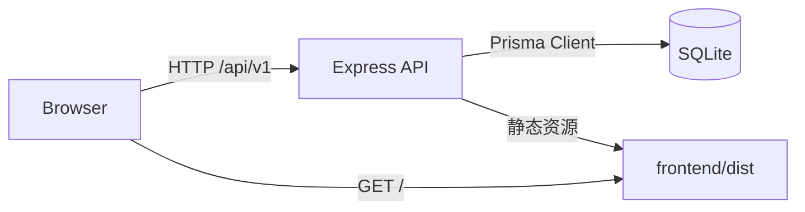

# 01. 整体架构与仓库结构

## 1. 目标与边界

- 系统定位：小型工贸企业的“工资核算 + 进销存”一体化单机系统
- 部署形态：单机本地服务（后端 HTTP + 前端静态资源），并提供 Windows 安装包/托盘启动脚本
- 通信方式：前端通过 REST API 调用后端（基路径 `/api/v1`）
- 数据访问：后端通过 Prisma 访问 SQLite 数据库（可通过 Prisma datasource 切换 MySQL）

## 2. 组件图（运行态）



- 后端同时承担 API 服务与生产环境下的静态资源托管（见 [backend/src/index.ts](file:///c:/Users/witer/Documents/pro/SettlementSystem/backend/src/index.ts#L71-L76)）
- 前端的 axios `baseURL` 默认指向 `/api/v1`（见 [request.ts](file:///c:/Users/witer/Documents/pro/SettlementSystem/frontend/src/api/request.ts#L3-L10)）

## 3. 仓库结构（目录职责）

```
SettlementSystem/
├── backend/        后端服务（Express + Prisma）
├── frontend/       前端应用（Vue3 + Vite + Element Plus）
├── deploy/         Windows 安装包构建与托盘启动脚本
├── docs/           规划/设计类文档（不一定与实现同步）
├── CODEME.md       面向开发者/自动化分析的索引
└── README.md       面向用户的使用说明
```

### 3.1 backend/

- 入口：Express app 与路由挂载（[backend/src/index.ts](file:///c:/Users/witer/Documents/pro/SettlementSystem/backend/src/index.ts)）
- 路由：资源路由拆分在 `backend/src/routes/*.routes.ts`
- 控制器：每类资源对应控制器 `backend/src/controllers/*.controller.ts`
- 中间件：JWT 鉴权（[auth.middleware.ts](file:///c:/Users/witer/Documents/pro/SettlementSystem/backend/src/middleware/auth.middleware.ts)）
- ORM/模型：Prisma schema（[backend/prisma/schema.prisma](file:///c:/Users/witer/Documents/pro/SettlementSystem/backend/prisma/schema.prisma)）与迁移（`backend/prisma/migrations/*`）

### 3.2 frontend/

- 入口：挂载 Vue 应用（[frontend/src/main.ts](file:///c:/Users/witer/Documents/pro/SettlementSystem/frontend/src/main.ts)）
- 路由：模块化菜单/页面路由树（[router/index.ts](file:///c:/Users/witer/Documents/pro/SettlementSystem/frontend/src/router/index.ts)）
- API：axios 实例与资源 API（`frontend/src/api/*.ts`）
- 状态：Pinia（`frontend/src/stores/*`）
- 页面：功能页面（`frontend/src/views/*`，按 salary/inventory/system/spec 等域划分）

### 3.3 deploy/

- 安装包构建：Node 脚本组装产物 + Inno Setup 编译（[deploy/build.js](file:///c:/Users/witer/Documents/pro/SettlementSystem/deploy/build.js)）
- 首次初始化：Prisma generate + migrate deploy（[deploy/first-run.bat](file:///c:/Users/witer/Documents/pro/SettlementSystem/deploy/first-run.bat)）
- 启动/停止：bat + PID 文件（[start.bat](file:///c:/Users/witer/Documents/pro/SettlementSystem/deploy/start.bat) / [stop.bat](file:///c:/Users/witer/Documents/pro/SettlementSystem/deploy/stop.bat)）
- 托盘：PowerShell NotifyIcon 控制服务启停（[tray.ps1](file:///c:/Users/witer/Documents/pro/SettlementSystem/deploy/tray.ps1)）

## 4. 关键约定

### 4.1 API 返回结构

- 后端多数接口返回：`{ code: number, message: string, data: any }`
- 前端响应拦截器：当 `code !== 0` 直接抛出异常（[request.ts](file:///c:/Users/witer/Documents/pro/SettlementSystem/frontend/src/api/request.ts#L22-L34)）

### 4.2 认证方式

- Bearer Token（JWT）写入 `Authorization: Bearer <token>`
- 前端请求拦截器自动附加 token（[request.ts](file:///c:/Users/witer/Documents/pro/SettlementSystem/frontend/src/api/request.ts#L13-L20)）
- 后端中间件校验并写入 `req.userId/req.userRole`（[authenticate](file:///c:/Users/witer/Documents/pro/SettlementSystem/backend/src/middleware/auth.middleware.ts#L11-L36)）

### 4.3 端口与代理（现状）

- 后端端口默认：`process.env.PORT || 3000`（[backend/src/index.ts](file:///c:/Users/witer/Documents/pro/SettlementSystem/backend/src/index.ts#L12)）
- Vite 代理默认：`/api -> http://localhost:4000`（[frontend/vite.config.ts](file:///c:/Users/witer/Documents/pro/SettlementSystem/frontend/vite.config.ts#L12-L18)）
- 建议：开发时统一使用同一端口（详见 [07_Runbook.md](file:///c:/Users/witer/Documents/pro/SettlementSystem/docs/wiki/07_Runbook.md)）

