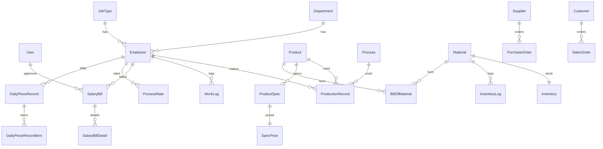

# 05. 数据库（Prisma Schema）与领域模型

数据模型定义位于 [backend/prisma/schema.prisma](file:///c:/Users/witer/Documents/pro/SettlementSystem/backend/prisma/schema.prisma)。

## 1. 数据源与迁移

- Prisma datasource：sqlite（[schema.prisma](file:///c:/Users/witer/Documents/pro/SettlementSystem/backend/prisma/schema.prisma#L7-L10)）
- 迁移：`backend/prisma/migrations/*`
- 生产部署迁移：`prisma migrate deploy`（见 [deploy/first-run.bat](file:///c:/Users/witer/Documents/pro/SettlementSystem/deploy/first-run.bat#L18-L24)）

## 2. 模型分区

### 2.1 系统基础

- `User`：系统用户（username 唯一），字段包含 `role/status`（[User](file:///c:/Users/witer/Documents/pro/SettlementSystem/backend/prisma/schema.prisma#L14-L23)）
- `Department`：部门/组织结构（parentId 预留树结构）（[Department](file:///c:/Users/witer/Documents/pro/SettlementSystem/backend/prisma/schema.prisma#L25-L34)）
- `JobType`：工种（[JobType](file:///c:/Users/witer/Documents/pro/SettlementSystem/backend/prisma/schema.prisma#L36-L45)）

### 2.2 工资核算与生产

#### 员工与计价

- `Employee`
  - `payType`：`hourly`/`piece`（[Employee.payType](file:///c:/Users/witer/Documents/pro/SettlementSystem/backend/prisma/schema.prisma#L49-L70)）
  - 时薪：`hourlyRate`
  - 计件：`pieceRate`（默认单价）
  - 关系：Department、JobType、ProcessRate、ProductionRecord、SalaryBill、WorkLog、DailyPieceRecord
- `Process`：工序（defaultPrice 作为工序默认单价）（[Process](file:///c:/Users/witer/Documents/pro/SettlementSystem/backend/prisma/schema.prisma#L101-L114)）
- `ProcessRate`：员工计价配置
  - 既可绑定到 `productId + processId`，也可只绑定 `processId`（productId 为空）（[ProcessRate](file:///c:/Users/witer/Documents/pro/SettlementSystem/backend/prisma/schema.prisma#L127-L138)）

#### 产品与工序关系

- `Product`：产品主数据（[Product](file:///c:/Users/witer/Documents/pro/SettlementSystem/backend/prisma/schema.prisma#L72-L88)）
- `ProductProcess`：产品工序顺序（sequence）绑定（[ProductProcess](file:///c:/Users/witer/Documents/pro/SettlementSystem/backend/prisma/schema.prisma#L116-L125)）

#### 生产记录与工资单

- `ProductionRecord`：计件员工的报工记录（employee/product/process/quantity/date）（[ProductionRecord](file:///c:/Users/witer/Documents/pro/SettlementSystem/backend/prisma/schema.prisma#L140-L154)）
- `WorkLog`：时薪员工的工时记录（hours/date）（[WorkLog](file:///c:/Users/witer/Documents/pro/SettlementSystem/backend/prisma/schema.prisma#L156-L166)）
- `SalaryBill`：月度工资单（employeeId + period 唯一性由业务控制，字段含分项合计与审核信息）（[SalaryBill](file:///c:/Users/witer/Documents/pro/SettlementSystem/backend/prisma/schema.prisma#L184-L209)）
- `SalaryBillDetail`：工资单明细（按日/按记录展开；type=hourly/piece）（[SalaryBillDetail](file:///c:/Users/witer/Documents/pro/SettlementSystem/backend/prisma/schema.prisma#L168-L183)）
- `SalaryCalculation`：历史计算结果/预留结构（当前业务使用以 SalaryBill 为主）（[SalaryCalculation](file:///c:/Users/witer/Documents/pro/SettlementSystem/backend/prisma/schema.prisma#L211-L218)）

### 2.3 进销存

#### 主数据

- `Supplier`：供应商（[Supplier](file:///c:/Users/witer/Documents/pro/SettlementSystem/backend/prisma/schema.prisma#L222-L235)）
- `Customer`：客户（含 creditLimit）（[Customer](file:///c:/Users/witer/Documents/pro/SettlementSystem/backend/prisma/schema.prisma#L236-L249)）
- `Material`：物料（safeStock、安全库存；barcode）（[Material](file:///c:/Users/witer/Documents/pro/SettlementSystem/backend/prisma/schema.prisma#L251-L268)）

#### 采购/销售

- `PurchaseOrder` + `PurchaseItem`（[PurchaseOrder](file:///c:/Users/witer/Documents/pro/SettlementSystem/backend/prisma/schema.prisma#L270-L295)）
  - `receivedQuantity`：收货进度
- `SalesOrder` + `SalesItem`（[SalesOrder](file:///c:/Users/witer/Documents/pro/SettlementSystem/backend/prisma/schema.prisma#L297-L322)）
  - `shippedQuantity`：发货进度

#### 库存

- `Inventory`：物料库存汇总（materialId 唯一）（[Inventory](file:///c:/Users/witer/Documents/pro/SettlementSystem/backend/prisma/schema.prisma#L324-L331)）
- `InventoryLog`：库存流水（type/referenceType/referenceId）（[InventoryLog](file:///c:/Users/witer/Documents/pro/SettlementSystem/backend/prisma/schema.prisma#L333-L344)）

#### BOM

- `BillOfMaterial`：产品用料清单（productId/materialId/quantity）（[BillOfMaterial](file:///c:/Users/witer/Documents/pro/SettlementSystem/backend/prisma/schema.prisma#L90-L99)）

### 2.4 产品规格计件系统

- `ProductSpec`：产品规格（dimensions/material/craft 为 JSON 字符串；difficulty + basePrice）（[ProductSpec](file:///c:/Users/witer/Documents/pro/SettlementSystem/backend/prisma/schema.prisma#L348-L371)）
- `SpecCoefficient`：规格系数规则（type/code/value/priority）（[SpecCoefficient](file:///c:/Users/witer/Documents/pro/SettlementSystem/backend/prisma/schema.prisma#L374-L385)）
- `SpecPrice`：规格最终单价（specId 唯一）（[SpecPrice](file:///c:/Users/witer/Documents/pro/SettlementSystem/backend/prisma/schema.prisma#L388-L398)）
- `DailyPieceRecord` + `DailyPieceRecordItem`：按日计件汇总与明细（[DailyPieceRecord](file:///c:/Users/witer/Documents/pro/SettlementSystem/backend/prisma/schema.prisma#L401-L428)）

## 3. 关键关系速查

## 4. 数据一致性与实现注意点（来自代码现状）

- 多数控制器直接创建 `new PrismaClient()` 并执行读写；如果未来要增强连接管理/事务一致性，建议统一 PrismaClient 的生命周期。
- `ProductSpec.dimensions/material/craft` 在 schema 中为 `String`，在控制器中按 JSON 解析（[spec.controller.ts](file:///c:/Users/witer/Documents/pro/SettlementSystem/backend/src/controllers/spec.controller.ts#L219-L224)），入库时需保证是可解析 JSON 字符串。

